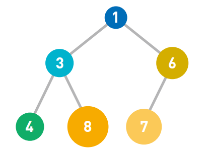
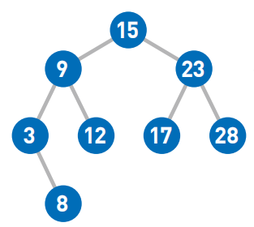
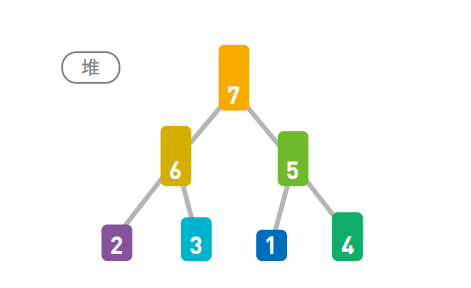
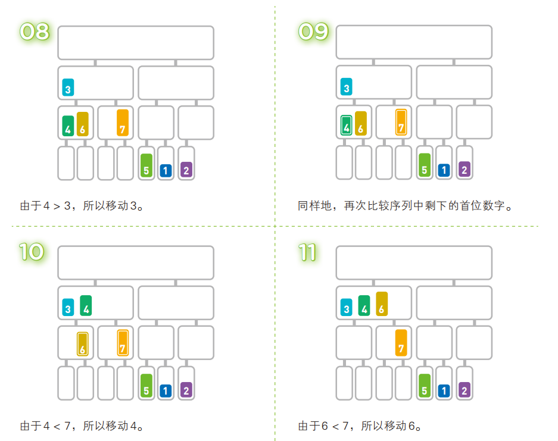
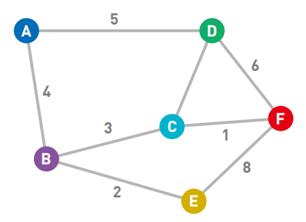
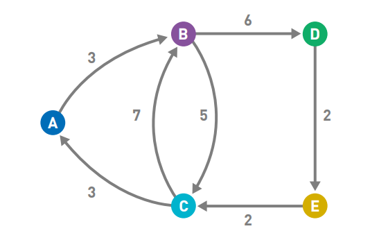

+++
date = '2026-02-21T20:50:13+08:00'
draft = false
title = '我的第一本算法书笔记'
tags = ["算法", "数据结构"]

+++

# 第一本算法书 · 笔记整理

---

## 目录

1. [算法概览](#算法概览)
2. [数据结构](#数据结构)
3. [排序算法](#排序算法)
4. [数组的查找](#数组的查找)
5. [图的搜索](#图的搜索)
6. [安全算法](#安全算法)
7. [聚类](#聚类)
8. [其他算法](#其他算法)

---

## 算法概览

**时间复杂度**：把每一个步骤需要完成的时间设置为一个 T，再计算总共的时间，取对时间影响最大的部分，即为时间复杂度。它是用于描述算法运行时间的函数。

例如，对于双重循环结构，会随输入 $n$ 变化的只有 $n$，因此时间复杂度为 $O(n^2)$。

---

## 数据结构

> **定义**：决定数据顺序和位置关系的结构。

### 链表

数据呈线性排列，**添加与删除均方便，但访问较耗时**。

**特点：**

- 每一个数据都有一个指针，指向下一个数据的内存地址（最后一个数据的指针不指向任何位置）
- 数据分散存储在内存中
- **顺序访问**：要想访问数据，必须从第一个数据开始依次往下访问
- 添加数据时，只需改变位置前后的指针指向即可，删除同理

|   操作    | 时间复杂度 | 说明                      |
| :-------: | :--------: | :------------------------ |
| 访问数据  |   $O(n)$   | 必须从头遍历              |
| 添加/删除 |   $O(1)$   | 只需改变指针，与 $n$ 无关 |

**扩展链表：**

- **循环链表**：用于保存数量固定的最新数据
- **双向链表**：设置前后两个指针，可双向遍历
  - 缺点：指针增加导致存储空间需求上升；添加/删除数据时需要改变更多指针

---

### 数组

数据存储在**连续内存空间**中，可直接通过下标算出地址（即"随机访问"）。

**添加或删除数据很复杂：**

1. 需要确保数组末尾有足够的存储空间
2. 把后面的数据逐一往后移动
3. 在空出的位置写入新数据

|   操作    | 时间复杂度 |
| :-------: | :--------: |
| 访问数据  |   $O(1)$   |
| 添加/删除 |   $O(n)$   |

**链表与数组对比：**

|      | 访问 | 添加 | 删除 |
| :--: | :--: | :--: | :--: |
| 链表 |  慢  |  快  |  快  |
| 数组 |  快  |  慢  |  慢  |

---

### 栈

数据呈线性排列，但**只能访问最新添加的数据**（类似一个桶，只能取最上面的元素）。

- 添加数据：**入栈**
- 取出数据：**出栈**
- 访问规则：**后进先出（LIFO，Last In First Out）**

---

### 队列

线性排列的数据结构，添加与取出操作分别在两端进行，可以想象成排成一列的人。

- 添加数据：**入队**
- 取出数据：**出队**
- 访问规则：**先进先出（FIFO，First In First Out）**

---

### 哈希表

存储由**键（Key）和值（Value）**组成的数据。

**存入数据：** 使用哈希函数计算键的哈希值，再取余（数组长度）得到存储位置，若发生冲突则在对应位置使用链表。

**取出数据：** 同样先计算哈希值并取余，找到对应位置，若不匹配则在链表中继续查找。

> 利用哈希函数可以快速访问目标数据。如果发生哈希冲突，则使用链表存储，可灵活应对任意数据量。需注意数组空间的合理设置——空间太小容易发生冲突，太大则造成内存浪费。

**解决冲突的方法：**

1. **链地址法**：在冲突位置使用链表存储多个数据
2. **开放地址法**：冲突发生时计算出候补地址，将数据存入候补位置

---

### 堆

一种**树形数据结构**，可用于实现优先队列。可自由添加数据，但取出数据时按最小值顺序取出。

**结构特点：**

- 各顶点称为**结点（Node）**，数据存储于结点中
- 每个结点最多有两个子结点，排列顺序为从上到下、从左到右
- **子结点的值必须大于父结点**，即根结点始终存储最小值

**操作流程：**

- **添加**：若新结点违反大小规则，则与父结点交换，直到满足条件
- **取出**：取走根结点后，将最后一个结点移到顶端，再重新调整堆结构

|    操作     | 时间复杂度  |
| :---------: | :---------: |
| 取出最小值  |   $O(1)$    |
| 添加 / 重构 | $O(\log n)$ |

---

### 二叉查找树

树形数据结构，每个结点最多有两个子结点。

**核心性质：**

- 每个结点的值**大于**其左子树上任意结点的值
- 每个结点的值**小于**其右子树上任意结点的值

**常见操作：**

|    操作    | 方法                                               |
| :--------: | :------------------------------------------------- |
| 查找最小值 | 从顶端一路向左下末端查找                           |
| 查找最大值 | 从顶端一路向右下末端查找                           |
|  添加数据  | 从顶端比较大小，小则左移，大则右移，新元素必在末端 |
|  查找数据  | 从上到下按大小关系比较，大于则找右边，小于则找左边 |

**删除数据：**

- 无子结点：直接删除
- 有一个子结点：将子结点移到被删除结点的位置
- 有两个子结点：在左子树中找到最大结点，移到被删除结点的位置

**时间复杂度：** 取决于树的高度

- 树形均衡时：$O(\log n)$
- 树向单侧纵向伸展时：$O(n)$

**扩展结构：**

- **平衡二叉查找树**：修正不均衡的树形，提高查找效率
- **B 树**：子结点数扩展为 $m$，子结点数可任意设定

---

## 排序算法

### 冒泡排序

比较相邻两个元素，若左边大于右边则交换，按顺序重复比较。每一轮排序能保证一个元素到达正确位置，共需 $n-1$ 轮。

- 时间复杂度：$O(n^2)$

---

### 选择排序

使用线性查找找出最小值，将其与最左边的元素交换，共需查找 $n-1$ 次。

- 时间复杂度：$O(n^2)$

---

### 插入排序

取出一个数据，与其左边的数字依次比较：若左边数字更小则停止，否则继续向左比较并插入到合适位置。

- 时间复杂度：$O(n^2)$

---

### 堆排序

将所有数据存入堆中，按**降序**（根结点最大）构建堆，依次取出根结点完成排序。

> 注意：这里的堆根结点最大，与之前"取最小值"的堆方向相反，但同样符合堆的性质。

- 插入 $n$ 个数据：$O(n \log n)$（每次插入 $O(\log n)$，共 $n$ 次）
- 取出并重构：$O(\log n)$，共 $n$ 轮，总计 $O(n \log n)$

> **说明**：堆中最后一行有超过一半的数据，这部分的时间仅需 $\frac{1}{2}\log n$，在大 $O$ 记法中忽略常数，整体仍为 $O(n \log n)$。

**缺点：** 堆是复杂的数据结构，实现难度较高。

---

### 归并排序

将序列不断拆分成等长的两个子序列，直到每个子序列仅剩一个元素，再逐层合并（将两个有序子序列合并为一个有序序列）。

**合并多个数字的子序列：** 比较两个子序列的首位数字，移动较小的数字到结果序列，再继续比较。

**时间分析：**

- 每一行的数据量均为 $n$，处理时间为 $O(n)$
- 共有 $\log_2 n$ 行
- 总时间复杂度：$O(n \log n)$

---

### 快速排序

从序列中随机选择一个**基准值（pivot）**，将其余数据分为"小于基准值"和"大于基准值"两组：

$$[\text{比基准值小的数}] \quad \text{基准值} \quad [\text{比基准值大的数}]$$

对两侧的子序列递归地继续快速排序（**分治法**），直到子序列只剩一个元素时排序完成。

**时间分析：**

- 每行每个数字都需与基准值比较，时间为 $O(n)$
- 若每次基准值均能将序列对半分，共有 $\log_2 n$ 行
- 最优/平均时间复杂度：$O(n \log n)$

---

## 数组的查找

### 线性查找

从头开始依次检查数据，直到找到目标。

- 时间复杂度：$O(n)$
- 适用场景：**添加频繁**或数据未排序时

---

### 二分查找

比较数组**中间**数据与目标数据的大小，每次将查找范围缩小一半。

- 时间复杂度：$O(\log n)$
- 前提：数据必须**已排好序**，添加数据时需插入合适位置
- 适用场景：**查找频繁**时

|   算法   | 时间复杂度  |    要求    |
| :------: | :---------: | :--------: |
| 线性查找 |   $O(n)$    |     无     |
| 二分查找 | $O(\log n)$ | 数据已排序 |

---

## 图的搜索

### 什么是图

由**顶点**和连接每对顶点的**边**所构成的图形。

- **加权图**：给边加上权重（表示顶点间的连接程度，如距离、费用等）

- **有向图**：边带有方向（箭头），只能单向行驶；无箭头则为无向图；有向图的边也可以设置非对称权重

---

### 广度优先搜索（BFS）

从起点出发，**优先搜索距离起点近的顶点**，由近及远扩展。

**过程：** 从起点开始，将相邻顶点加入候补队列；搜索完附近的点后，从队列中取出最早加入的候补顶点继续搜索。

> 候补顶点用**先入先出（FIFO）**方式管理，可用**队列**数据结构实现。

**特征：** 目标顶点离起点越近，搜索越快；适合寻找**最短路径**。

> 图若没有闭环，则称为**树**。

---

### 深度优先搜索（DFS）

沿着一条路径**不断往下搜索直到无法继续**，然后折返，再搜索下一条候补路径。

**过程：** 每次选择**最新加入的**候补顶点作为下一步，一路向深处搜索。

> 候补顶点采用**后入先出（LIFO）**方式管理，可用**栈**数据结构实现。

**BFS vs DFS 对比：**

- BFS 选择最早成为候补的顶点 → 由近及远搜索
- DFS 选择最新成为候补的顶点 → 沿路径一路深入

---

### 贝尔曼-福特算法

用于求**带权图的单源最短路径**，支持负权边。

**过程：**

1. 将起点权重设为 $0$，其余顶点设为无穷大
2. 遍历所有边，计算"该边一端顶点的权重 + 边的权重"
3. 若计算结果小于另一端顶点的当前值，则更新
4. 重复 $n$ 轮，最终留下的边即为最短路径

**时间复杂度：** $O(nm)$（$n$ 为顶点数，$m$ 为边数）

> **注意**：若图中存在权重和为负的环（负权环），则不存在最短路径，因为可以无限循环使路径权重不断减小。

---

### 狄克斯特拉算法

用于求**不含负权边的带权图的单源最短路径**，比贝尔曼-福特更高效。

**过程：**

1. 将起点权重设为 $0$，其余顶点设为无穷大
2. 从当前顶点可直达且未被搜索的顶点中，选出候补顶点并更新权重
3. 选择候补顶点中**权重最小**的顶点作为下一步顶点
4. 重复以上过程，直到到达终点

**时间复杂度：**

- 无优化：$O(n^2)$
- 对数据结构优化（如使用优先队列）：$O(m + n \log n)$

> **注意**：含负权边时可能无法得出正确答案，此时应使用贝尔曼-福特算法。

---

### A* 算法

在狄克斯特拉算法基础上引入**启发信息**，加速搜索过程。

**核心思路：** 预先估算各顶点到终点的距离，将"起点到当前顶点的实际距离 + 当前顶点到终点的估算距离"作为优先级依据，每次选择该值最小的顶点继续搜索。

---

## 安全算法

### 传输数据的四大安全问题与应对措施

|   问题   |       应对措施       |
| :------: | :------------------: |
|   窃听   |       加密技术       |
|   假冒   | 消息认证码、数字签名 |
|   篡改   | 消息认证码、数字签名 |
| 事后否认 |       数字签名       |

---

### 加密基础知识

- **加密**：利用密钥对数据进行数值运算，将数据转变为第三方无法理解的形式（密文）
- **解密**：利用密钥对密文进行计算，将其恢复为原始数据
- 所有数据（文本、音频、图像）在计算机中均以二进制表示

---

### 哈希函数

将任意输入数据转换为**固定长度**的无规律数值（哈希值），常用十六进制表示，可作为数据摘要。

**主要特性：**

1. 输入相同 → 输出必然相同（同一算法下）
2. 输入相似 → 输出哈希值不相似
3. 不同输入可能产生相同哈希值（**哈希冲突**，概率极低）
4. **不可逆**：无法从哈希值反推原始数据
5. 计算哈希值的运算相对容易

**常用算法：** MD5、SHA-1、SHA-2（前两者存在安全隐患，推荐使用 SHA-2）

**典型应用：** 密码存储。服务器不直接保存用户密码，而是保存其哈希值。用户登录时，计算输入密码的哈希值并与存储值比对，即使哈希值泄露，也无法反推出原始密码。

---

### 共享密钥加密（对称加密）

加密和解密使用**相同的密钥**。

**问题：密钥分配问题** —— 发送方需要将密钥安全地传递给接收方，而在互联网上传输密钥存在被窃听的风险。

解决方案：密钥交换协议 / 公开密钥加密。

**缺陷：** 随着通信人数的增多，所需密钥数量急剧增加。

---

### 公开密钥加密（非对称加密）

接收方生成一对密钥：**公开密钥（公钥）** 和 **私有密钥（私钥）**，将公钥发送给发送方。

- 发送方使用**公钥加密**数据
- 接收方使用**私钥解密**密文
- 公钥无法解密密文

**常用算法：** RSA 算法、椭圆曲线加密算法（ECC）

**安全隐患：中间人攻击** —— 攻击者可替换公钥，解密数据后再转发给接收方，双方均无法察觉。

**解决方案：** 使用**数字证书**验证公钥的合法性。

**额外问题：** 加密与解密十分耗时，不适合持续发送零碎数据，需使用**混合加密**解决。

**加密算法的基本要求：**

1. 可以用某个数值对数据进行加密计算
2. 使用另一个数值对加密数据进行计算可使数据恢复原样
3. 无法从一种密钥推算出另一种密钥

---

### 混合加密

结合共享密钥加密和公开密钥加密的优势：

- 用**速度较快的共享密钥**对文件数据加密
- 用**安全的公开密钥**对共享密钥本身进行加密传输

**流程（A 向 B 发送数据）：**

1. B 生成公钥和私钥，将公钥发给 A
2. A 用共享密钥加密数据
3. A 用 B 的公钥对共享密钥加密，将加密后的密钥发给 B
4. B 用私钥解密，获得共享密钥
5. B 用共享密钥解密数据

**优势：** 兼具安全性与处理速度。

**应用：** SSL/TLS 协议（为网络通信提供安全保障）即采用了混合加密方法。

---

### 迪菲-赫尔曼密钥交换

通过将双方共有的秘密数值**隐藏在公开数值的运算中**，安全地交换密钥，无需预先共享秘密。

**数学本质：**

1. A 准备素数 $P$ 和生成元 $G$，发送给 B
2. A 和 B 分别准备各自的秘密数字 $X$ 和 $Y$（均小于 $P-2$）
3. A 计算 $G^X \mod P$，B 计算 $G^Y \mod P$，双方将结果互相发送
4. A 计算 $(G^Y \mod P)^X \mod P$，B 计算 $(G^X \mod P)^Y \mod P$，双方得到相同结果

**安全性基础：** 由 $P$、$G$ 和 $G^X \mod P$ 求出 $X$，即"**离散对数问题**"，目前无法高效求解。

---

### 消息认证码（MAC）

用于实现**认证**和**检测篡改**功能。

**原理：** 发送方使用密文和密钥生成 MAC 值并一同发送；接收方用同样的密钥和密文计算 MAC 值，比较两者是否一致以判断是否被篡改。

MAC 可看作是由密钥和密文组成的字符串的"哈希值"，常用算法有 HMAC、OMAC、CMAC 等（目前 HMAC 应用最广泛）。

**缺点：** 通信双方都能生成 MAC，无法确定信息的来源（即无法防止否认），此问题由**数字签名**解决。

---

### 数字签名

在消息认证码的基础上，还可解决**事后否认**问题。

**流程（A 向 B 发送签名消息）：**

1. A 将公钥发送给 B
2. A 使用**私钥**对消息（或消息的哈希值）进行加密，生成**数字签名**
3. A 将消息和签名一同发送给 B
4. B 使用 A 的**公钥**对签名解密，与收到的消息进行比对

> 这与公开密钥加密的流程相反：加密时用私钥，解密时用公钥。

**时间优化：** 由于加解密耗时，实际上通常是对消息的**哈希值**进行签名，而非消息本体。

**缺点：** 无法确认公钥的真正持有者，可能被冒充，此问题由**数字证书**解决。

---

### 数字证书

通过权威的**认证中心（CA，Certification Authority）**验证公钥的合法性。

**流程：**

1. A 向 CA 提交公钥及个人资料（如邮箱）
2. CA 核实后，用自己的私钥对 A 的资料生成数字签名
3. CA 将签名和资料合并为**数字证书**，发给 A
4. A 将证书发给 B
5. B 从 CA 获取公钥，验证证书上的签名是否来自 CA
6. 验证通过后，B 从证书中提取 A 的公钥

CA 本身的合法性由更高级的 CA 签名保证，形成**信任链**；根 CA 通常与政府关联，具有社会公信力。

- 网站的证书称为**服务器证书**
- 数字证书的一系列技术规范称为**公钥基础设施（PKI）**

---

## 聚类

将相似的对象分为一组，**相似程度**通常用两组数据所表示的点之间的**欧几里得距离的平方**来衡量。

### k-means 算法

将数据按要求分为 $k$ 个簇。

**步骤：**

1. **随机选点**：随机选择 $k$ 个点作为簇的初始中心点
2. **计算距离**：计算每个数据点与各中心点的距离，将其归入最近的簇
3. **更新中心点**：计算各个簇的重心，将中心点移动到重心位置
4. **重复执行**：重新划分簇，直到中心点不再变化为止

---

### 层次聚类算法

初始时每个数据自成一个独立的簇，不断将距离最近的两个簇合并，直到满足条件。

需要预先定义"簇与簇之间的距离"的计算方式。

---

## 其他算法

### 欧几里得算法

用于计算两个数的**最大公约数（GCD）**。

**步骤：**

1. 用较小的数去除较大的数，求余数（mod 运算）
2. 再用除数和余数继续进行 mod 运算
3. 重复以上操作，直到余数为 $0$
4. 最后一个不为 $0$ 的余数即为最大公约数

---

### 素性测试

判断一个数是否为素数，利用**费马小定理**：

$$\text{若 } p \text{ 为素数，则对任意 } n < p，有  n^p \equiv n \pmod{p}$$

**步骤：** 随机选择若干个小于测试数的整数 $n$，分别计算 $n^p \mod p$，若结果均等于 $n$，则判定该数为素数（概率性判断）。

---

### 网页排名（PageRank）

在搜索网页时对搜索结果进行排序的算法，**链入页面越多的网页，重要性越高**。

**核心规则：**

1. 一个网页的权重等于所有链入页面的权重之和
2. 若一个页面链向多个页面，则该页面的权重由这些页面**平分**
3. 当存在环状链接时，采用**随机游走模型**：模拟用户随机点击链接的行为，记录每个网页被访问的次数，以此估算权重

---

### 汉诺塔

经典的**递归算法**。将 $n$ 个盘子从 A 柱移到 C 柱（借助 B 柱）的策略：

- 先将上面 $n-1$ 个盘子移到辅助柱
- 再将最大的盘子移到目标柱
- 最后将 $n-1$ 个盘子从辅助柱移到目标柱

**最少移动次数：**

$$T(n) = 2^n - 1$$

